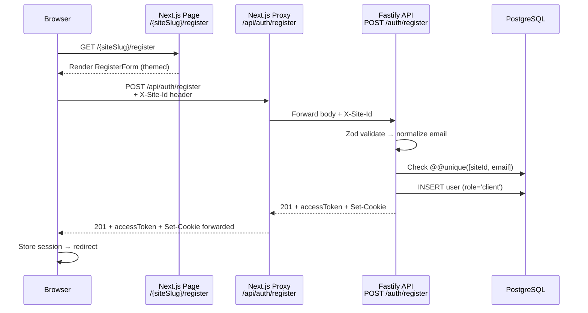

# Design Document: Multi-Tenant Public Registration

## Overview

This design implements a public user registration system that is fully multi-tenant, following the existing Arte Hub architecture patterns. The backend (Fastify API) owns all business logic; the Next.js frontend provides a thin proxy and UI layer. Registration creates `client`-role users scoped to a specific tenant, with complete cookie and data isolation between sites.

**Key architectural decision**: The Fastify backend already has the complete registration endpoint implemented (`POST /auth/register`). This design focuses on the **frontend components that need to be created** to expose that endpoint to users, plus minor middleware updates.

### What Already Exists (NO changes needed)

| Component | File | Status |
|-----------|------|--------|
| Registration endpoint | `apps/api/src/modules/auth/auth.routes.ts` | ✅ Complete |
| Register handler | `apps/api/src/modules/auth/auth.controller.ts` | ✅ Complete |
| Zod validation schema | `apps/api/src/modules/auth/auth.schema.ts` | ✅ Complete |
| Register service logic | `apps/api/src/modules/auth/auth.service.ts` | ✅ Complete |
| User creation repository | `apps/api/src/modules/auth/auth.repository.ts` | ✅ Complete |
| Password hashing | `apps/api/src/lib/password.ts` | ✅ Complete |
| Site resolution | `apps/api/src/lib/sites.ts` | ✅ Complete |
| Auth hook (tenant isolation) | `apps/api/src/hooks/authenticate.ts` | ✅ Complete |
| Database schema (composite key) | `apps/api/prisma/schema.prisma` | ✅ Complete |

### What Needs to Be Created

| Component | File | Action |
|-----------|------|--------|
| Registration form | `apps/web/src/components/auth/RegisterForm.tsx` | **Create** |
| Platform register page | `apps/web/src/app/platform/register/page.tsx` | **Create** |
| Marketplace register page | `apps/web/src/app/marketplace/register/page.tsx` | **Create** |
| Tattoo register page | `apps/web/src/app/tattoo/register/page.tsx` | **Create** |
| Music register page | `apps/web/src/app/music/register/page.tsx` | **Create** |
| Middleware redirect | `/register` → `/platform/register` via middleware | **Modify** |
| Proxy route | `apps/web/src/app/api/auth/register/route.ts` | **Create** |
| Middleware | `apps/web/src/middleware.ts` | **Modify** |
| API documentation | `apps/api/README.md` | **Modify** |

## Architecture

### Request Flow



### Component Diagram

```
┌─────────────────────────────────────────────────────────────┐
│ Frontend (apps/web) — TO BE CREATED                          │
│                                                              │
│  /{siteSlug}/register (page.tsx) — server component         │
│       └── AuthLayout (existing, reused)                      │
│       └── RegisterForm (new client component)                │
│              └── POST /api/auth/register + X-Site-Id header  │
│                                                              │
│  /api/auth/register/route.ts (new proxy)                    │
│       └── Mirrors existing /api/auth/login/route.ts pattern │
│       └── Forwards to ${API_URL}/auth/register              │
│       └── Forwards Set-Cookie headers back to browser        │
│                                                              │
│  /register/page.tsx (new redirect)                          │
│       └── redirect('/platform/register')                     │
│                                                              │
│  middleware.ts (modify)                                      │
│       └── Add /register → /platform/register redirect       │
└─────────────────────────────────────────────────────────────┘
                          │
                          ▼
┌─────────────────────────────────────────────────────────────┐
│ Backend (apps/api) — ALREADY EXISTS, NO CHANGES             │
│                                                              │
│  POST /auth/register (auth.routes.ts)                       │
│       └── auth.controller.ts → registerHandler              │
│       └── auth.schema.ts → RegisterSchema (Zod)            │
│       └── auth.service.ts → register()                      │
│       └── auth.repository.ts → createUser()                 │
│       └── lib/password.ts → hashPassword()                  │
│       └── lib/sites.ts → resolveSiteFromRequest()           │
└─────────────────────────────────────────────────────────────┘
                          │
                          ▼
┌─────────────────────────────────────────────────────────────┐
│ Database (PostgreSQL via Prisma) — ALREADY EXISTS            │
│                                                              │
│  users table                                                 │
│    @@unique([siteId, email]) — composite key                │
│    role defaults to 'client'                                 │
│    password stores bcrypt hash (12 rounds)                   │
└─────────────────────────────────────────────────────────────┘
```

## Components and Interfaces

### 1. Registration Pages (Server Components)

Each tenant gets a registration page at `apps/web/src/app/{siteSlug}/register/page.tsx`. These are server components that import the shared `RegisterForm` client component and pass the site config.

**Pattern** (mirrors existing login pages exactly):

```typescript
// apps/web/src/app/platform/register/page.tsx
import { SITES } from '@/lib/sites'
import { AuthLayout } from '@/components/auth/AuthLayout'
import { RegisterForm } from '@/components/auth/RegisterForm'

const site = SITES.platform!

export const metadata = { title: `Criar conta — ${site.displayName}` }

export default function PlatformRegisterPage() {
  return (
    <AuthLayout site={site}>
      <RegisterForm site={site} />
    </AuthLayout>
  )
}
```

Identical pages for: `marketplace`, `tattoo`, `music` — each referencing their respective `SITES[slug]`.

A redirect for `/register` → `/platform/register` is handled by middleware (matching the existing `/login` → `/platform/login` pattern). No separate redirect page needed.

### 2. RegisterForm Component

Located at `apps/web/src/components/auth/RegisterForm.tsx`. Client component (`'use client'`).

**Interface:**
```typescript
interface RegisterFormProps {
  site: SiteConfig
}
```

**Behavior:**
- Collects: email (required), password (required, min 6), name (optional)
- Submits to `/api/auth/register` with `X-Site-Id: site.id` header
- On 201: redirects to `/dashboard` (platform) or `/{site.slug}/dashboard` (other tenants)
- On 409: displays "Email já cadastrado neste site"
- On 422: displays field-level errors from response
- On other errors: displays generic error message "Erro ao criar conta. Tente novamente."
- Disables submit button during request
- Includes link to `/{site.slug}/login`

**Visual pattern**: Same structure, spacing, input styling, error display, and themed button as `LoginForm`.

### 3. Next.js Proxy Route

Located at `apps/web/src/app/api/auth/register/route.ts`. Mirrors the existing `/api/auth/login/route.ts` exactly:

```typescript
export async function POST(req: NextRequest): Promise<NextResponse> {
  // 1. Parse body (400 if invalid JSON)
  // 2. Extract X-Site-Id header (default 'platform')
  // 3. Forward to ${API_URL}/auth/register
  // 4. Forward Set-Cookie headers from API response
  // 5. Return API status + body (503 if unreachable)
}
```

### 4. Middleware Update

Add `/register` → `/platform/register` redirect in `middleware.ts`, matching the existing `/login` → `/platform/login` pattern:

```typescript
if (pathname === '/register') {
  return NextResponse.redirect(new URL('/platform/register', req.url))
}
```

### 5. AuthLayout Enhancement

The existing `AuthLayout` component will be reused as-is. The `RegisterForm` will include a login link within its own markup (below the form), similar to how login pages might link to registration.

## Data Models

### User Record (existing — no changes)

```prisma
model User {
  id        String   @id @db.Uuid
  siteId    String   @default("platform") @map("site_id")
  email     String
  password  String?  // bcrypt hash
  role      UserRole @default(artist)
  artistId  String?  @map("artist_id") @db.Uuid
  createdAt DateTime @default(now())
  updatedAt DateTime @updatedAt

  @@unique([siteId, email])  // Composite key for multi-tenant isolation
}
```

### Registration Request/Response

**Request body** (validated by existing `RegisterSchema`):
```typescript
{
  email: string    // required, valid email format
  password: string // required, min 6 chars
  name?: string    // optional, 1-100 chars
}
```

**Success response** (HTTP 201):
```typescript
{
  accessToken: string  // JWT, 15-min expiry
  siteId: string       // resolved tenant ID
}
// + Set-Cookie: ah_{siteId}_refresh=<token>; HttpOnly; SameSite=Strict; Path=/; Max-Age=604800
// + Set-Cookie: refreshToken=<token>; HttpOnly; SameSite=Strict; Path=/; Max-Age=604800
```

**Error responses:**
- 409: `{ error: "Email já cadastrado neste site" }`
- 422: `{ error: "Dados inválidos", details: { fieldErrors: {...}, formErrors: [...] } }`
- 500: `{ error: "Erro interno" }`

### Site Configuration (existing — no changes)

```typescript
interface SiteConfig {
  id: string          // 'platform' | 'marketplace' | 'tattoo' | 'music'
  slug: string        // URL segment
  displayName: string // UI heading
  theme: SiteTheme   // primaryColor, gradientMain, backgroundColor
  authEnabled: boolean
  cookieName: string  // 'ah_{id}_refresh'
}
```

## Correctness Properties

*A property is a characteristic or behavior that should hold true across all valid executions of a system — essentially, a formal statement about what the system should do. Properties serve as the bridge between human-readable specifications and machine-verifiable correctness guarantees.*

### Property 1: Email Normalization Idempotence

*For any* email string, normalizing it (lowercase + trim) and then normalizing the result again should produce the same value — normalization is idempotent.

**Validates: Requirements 4.3**

### Property 2: Password Hash Round-Trip

*For any* valid password (6 characters minimum, 72 bytes maximum), hashing it with bcrypt and then verifying the original plaintext against the hash should return true.

**Validates: Requirements 6.5, 6.1**

### Property 3: Role Invariant on Public Registration

*For any* registration input (including inputs with arbitrary extra fields such as `role: 'admin'`), the user created via public registration should always have role equal to `'client'`.

**Validates: Requirements 7.1, 7.2, 7.3, 7.4**

### Property 4: Cross-Tenant Email Independence

*For any* valid email and *for any* two distinct tenant IDs from the configured sites, registering the email in tenant A should not prevent successful registration of the same email in tenant B.

**Validates: Requirements 5.3**

### Property 5: Same-Tenant Duplicate Rejection

*For any* valid email and *for any* tenant, registering the email once succeeds, and registering the same email in the same tenant a second time should fail with a 409 conflict error.

**Validates: Requirements 5.2**

### Property 6: Cross-Tenant Authentication Rejection

*For any* valid credentials registered in tenant A, and *for any* tenant B where B ≠ A, attempting to authenticate with those credentials in tenant B should fail (the authenticate hook rejects the request due to siteId mismatch).

**Validates: Requirements 8.5, 8.6, 10.2, 10.4**

### Property 7: Zod Schema Rejects Invalid Inputs

*For any* input where the email is not a valid email format OR the password is shorter than 6 characters, the RegisterSchema should reject the input (safeParse returns success=false).

**Validates: Requirements 4.1, 4.2**

### Property 8: Site Resolution Fallback

*For any* string value that is not a valid site ID (not in `['platform', 'marketplace', 'tattoo', 'music']`), the `resolveSiteFromRequest` function should return the platform site configuration as fallback.

**Validates: Requirements 4.4, 4.5, 5.5, 5.6**

### Property 9: Tenant Cookie Naming

*For any* tenant and *for any* successful registration in that tenant, the response should set a cookie whose name equals the tenant's configured `cookieName` field (e.g., `ah_marketplace_refresh` for marketplace).

**Validates: Requirements 5.4, 8.1, 8.4**

### Property 10: Post-Registration Redirect Logic

*For any* site configuration, the post-registration redirect destination should be `/dashboard` when the site ID is `'platform'`, and `/{site.slug}` for all other site IDs.

**Validates: Requirements 2.3, 9.3**

## Error Handling

| Scenario | HTTP Status | Error Message | Component |
|----------|-------------|---------------|-----------|
| Invalid JSON body | 400 | "Corpo da requisição inválido" | Proxy route |
| Zod validation failure | 422 | "Dados inválidos" + fieldErrors | Backend controller |
| Duplicate email in same tenant | 409 | "Email já cadastrado neste site" | Backend service |
| bcrypt hashing failure | 500 | "Erro interno" | Backend controller |
| Token generation failure | 500 | "Erro interno" | Backend controller |
| API unreachable | 503 | "Serviço indisponível" | Proxy route |
| Unknown server error | 500 | "Erro interno" | Backend controller |

**Frontend error display strategy:**
- 409 → Show specific message "Email já cadastrado neste site"
- 422 → Show field-level errors adjacent to each field
- Other → Show generic "Erro ao criar conta. Tente novamente."

## Testing Strategy

### Property-Based Tests (fast-check + vitest)

All property tests use `fast-check` (already installed in `apps/api`) with minimum 100 iterations per property.

| Property | Test File | Tag |
|----------|-----------|-----|
| Email Normalization Idempotence | `auth.service.property.test.ts` | Feature: multi-tenant-public-registration, Property 1 |
| Password Hash Round-Trip | `auth.service.property.test.ts` | Feature: multi-tenant-public-registration, Property 2 |
| Role Invariant | `auth.isolation.property.test.ts` | Feature: multi-tenant-public-registration, Property 3 |
| Cross-Tenant Email Independence | `auth.isolation.property.test.ts` | Feature: multi-tenant-public-registration, Property 4 |
| Same-Tenant Duplicate Rejection | `auth.isolation.property.test.ts` | Feature: multi-tenant-public-registration, Property 5 |
| Cross-Tenant Auth Rejection | `auth.isolation.property.test.ts` | Feature: multi-tenant-public-registration, Property 6 |
| Zod Schema Rejects Invalid Inputs | `auth.service.property.test.ts` | Feature: multi-tenant-public-registration, Property 7 |
| Site Resolution Fallback | `auth.service.property.test.ts` | Feature: multi-tenant-public-registration, Property 8 |
| Tenant Cookie Naming | `auth.isolation.property.test.ts` | Feature: multi-tenant-public-registration, Property 9 |
| Post-Registration Redirect Logic | Frontend unit test | Feature: multi-tenant-public-registration, Property 10 |

### Example-Based Tests (vitest)

| Test | File | What it verifies |
|------|------|------------------|
| Proxy forwards correctly | `apps/web` tests | Body, headers, Set-Cookie forwarding |
| Proxy returns 400 for invalid JSON | `apps/web` tests | Error handling |
| Proxy returns 503 when API unreachable | `apps/web` tests | Network failure handling |
| Form renders all fields | `apps/web` tests | email, password, name inputs exist |
| Form disables button during submit | `apps/web` tests | Loading state |
| Form shows 409 error message | `apps/web` tests | Duplicate email UX |
| Form shows 422 field errors | `apps/web` tests | Validation error UX |
| Middleware redirects /register | `apps/web` tests | Redirect to /platform/register |

### Security Considerations

1. **No privileged role escalation**: `RegisterSchema` does not accept `role`; service hardcodes `'client'`
2. **Password never stored in plaintext**: bcrypt 12 rounds via `lib/password.ts`
3. **Cookie security**: HttpOnly prevents XSS access; SameSite=Strict prevents CSRF; Secure in production
4. **Tenant resolution from header only**: `resolveSiteFromRequest` reads `X-Site-Id` header (set by server-side proxy), never from body
5. **Rate limiting**: Existing `@fastify/rate-limit` plugin applies to all routes including registration
6. **Input sanitization**: Zod strips unknown fields; email normalized before DB query

### Dependencies

No new dependencies required. All needed packages are already installed:
- `zod` (validation) — backend
- `bcryptjs` (password hashing) — backend
- `@fastify/cookie` (cookie management) — backend
- `@fastify/jwt` (token signing) — backend
- `fast-check` (property-based testing) — backend dev
- `vitest` (test runner) — both apps
