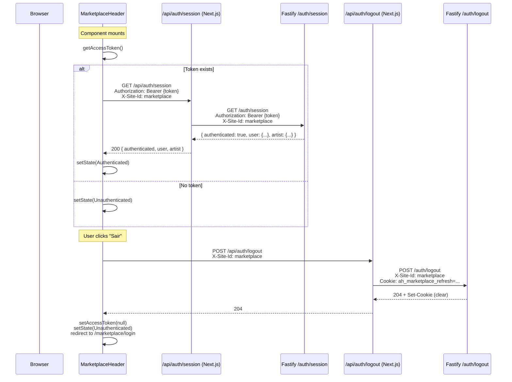

# Design Document: Tenant Authenticated Header

## Overview

This feature updates the MarketplaceHeader (and future tenant headers) to reflect the user's authentication state by consuming session data from the existing Fastify API. The header transitions between two states:

- **Unauthenticated**: Shows "Entrar" button linking to `/{siteSlug}/login`
- **Authenticated**: Shows a personalized greeting ("Olá, {name}"), a "Minha Conta" link, and a "Sair" logout action

The implementation follows the existing Fastify-first architecture: the frontend is a thin UI layer that consumes session state from the API. No JWT decoding, token validation, or business logic resides in the frontend.

### Key Design Decisions

1. **Session check via API, not JWT decode**: The current MarketplaceHeader decodes the JWT payload locally to determine `isArtist`. This violates the Fastify-first principle. The new design replaces this with a proper `GET /api/auth/session` call that returns role and name from the backend.

2. **Name field addition to session response**: The `User` model has no `name` field, but `Artist` has one. The session endpoint will be extended to return `artist.name` when available, and fall back to `email` for non-artist users. This keeps the greeting logic in the API.

3. **Reuse existing infrastructure**: The logout proxy (`/api/auth/logout`), session proxy (`/api/auth/session`), and `client.ts` token management already exist. No new proxy routes are needed.

4. **Tenant isolation via existing patterns**: `X-Site-Id` header + per-tenant cookies (`ah_{siteId}_refresh`) already provide full isolation. The header simply passes the correct `X-Site-Id` for its tenant.

## Architecture



### Architectural Constraints

- **No business logic in Next.js**: The frontend only reads the `authenticated`, `user`, and `artist` fields from the session response. It does not decode JWTs or validate tokens.
- **Existing proxy routes reused**: `/api/auth/session` and `/api/auth/logout` already exist and correctly forward `X-Site-Id` and cookies.
- **In-memory token**: `accessToken` lives in a module-level variable in `client.ts`. It is lost on page refresh, which is correct — the refresh cookie handles session persistence.

## Components and Interfaces

### Modified Components

#### 1. MarketplaceHeader (apps/web/src/components/marketplace/MarketplaceHeader.tsx)

**Current behavior**: Reads `getAccessToken()`, decodes JWT payload locally to determine `isArtist` and `isLoggedIn`.

**New behavior**: 
- On mount, calls `getAccessToken()`. If present, fetches `GET /api/auth/session` with `Authorization` and `X-Site-Id` headers.
- Stores session state: `{ authenticated, user, artist }` or null.
- Derives display name: `artist?.name ?? user?.email ?? 'Minha Conta'` (truncated to 20 chars).
- Derives `isArtist` from `user.role === 'artist' || user.role === 'admin'`.
- Shows loading skeleton (no auth UI) while session check is in progress.
- Authenticated state shows: greeting, "Minha Conta" link, "Sair" button.
- Unauthenticated state shows: "Entrar" link.

**New internal state**:
```typescript
type AuthState = 'loading' | 'authenticated' | 'unauthenticated'

interface SessionData {
  user: { id: string; email: string; role: string; siteId: string; name?: string }
  artist: { id: string; slug: string; name: string } | null
}
```

#### 2. Auth Service — getSession (apps/api/src/modules/auth/auth.service.ts)

**Current behavior**: Returns `{ authenticated, user: { id, email, role, siteId }, artist: { id, slug } | null }`.

**New behavior**: Extends `artist` selection to include `name` field so the frontend can display a personalized greeting for artist/admin users.

**Updated SessionData type**:
```typescript
export interface SessionData {
  authenticated: true
  user: {
    id: string
    email: string
    role: string
    siteId: string
  }
  artist: {
    id: string
    slug: string
    name: string  // ← added
  } | null
}
```

#### 3. Auth Repository — findArtistById (apps/api/src/modules/auth/auth.repository.ts)

**Current behavior**: Returns `{ id, slug }`.

**New behavior**: Returns `{ id, slug, name }` — adds `name` to the select clause.

### Unchanged Components (Reused As-Is)

- `/api/auth/session/route.ts` — session proxy (already forwards Authorization + X-Site-Id)
- `/api/auth/logout/route.ts` — logout proxy (already forwards cookies + X-Site-Id)
- `client.ts` — `getAccessToken()`, `setAccessToken()` (unchanged API)
- `middleware.ts` — cookie-based route protection (unchanged)
- `apps/api/src/hooks/authenticate.ts` — JWT verification hook (unchanged)

### Helper Function

```typescript
// Truncates display name to maxLen characters with ellipsis
function truncateDisplayName(value: string, maxLen = 20): string {
  return value.length > maxLen ? `${value.slice(0, maxLen)}…` : value
}
```

## Data Models

### Session Response (API → Frontend)

```typescript
// GET /auth/session response (from Fastify)
interface SessionResponse {
  authenticated: true
  user: {
    id: string
    email: string
    role: 'admin' | 'artist' | 'editor' | 'client'
    siteId: string
  }
  artist: {
    id: string
    slug: string
    name: string
  } | null
}
```

### Header Auth State (Frontend internal)

```typescript
type AuthState = 'loading' | 'authenticated' | 'unauthenticated'

// Derived from SessionResponse
interface HeaderSession {
  displayName: string       // artist.name ?? user.email, truncated to 20 chars
  role: string              // user.role
  isArtist: boolean         // role === 'artist' || role === 'admin'
  accountUrl: string        // /{siteSlug}/minha-conta
  loginUrl: string          // /{siteSlug}/login
}
```

### Display Name Resolution Logic

Priority order for the greeting text:
1. `artist.name` (if user has an artist profile)
2. `user.email` (fallback for client/editor users)
3. `"Minha Conta"` (fallback if both are unavailable — defensive)

All values truncated to 20 characters with ellipsis (`…`) if exceeded.

### Tenant Resolution

The header resolves its tenant from the page URL path using the existing `resolveSiteFromPath()` function from `@/lib/sites`. This provides:
- `site.id` → used in `X-Site-Id` header for API calls
- `site.slug` → used in navigation URLs (`/{slug}/login`, `/{slug}/minha-conta`)

## Correctness Properties

*A property is a characteristic or behavior that should hold true across all valid executions of a system — essentially, a formal statement about what the system should do. Properties serve as the bridge between human-readable specifications and machine-verifiable correctness guarantees.*

### Property 1: Display name resolution

*For any* valid session response, the resolved display name SHALL be `artist.name` when the session includes a non-null artist with a name, otherwise `user.email` when available, otherwise the literal string `"Minha Conta"`.

**Validates: Requirements 2.1, 2.2, 2.3**

### Property 2: Display name truncation

*For any* string input to the truncation function, the output SHALL equal the input unchanged when its length is ≤ 20 characters, or the first 20 characters followed by "…" when its length exceeds 20 characters.

**Validates: Requirements 2.5**

### Property 3: Tenant URL construction

*For any* valid SiteConfig, the login URL SHALL equal `/${site.slug}/login` and the account URL SHALL equal `/${site.slug}/minha-conta`. These URLs are used for the "Entrar" link, the "Minha Conta" link, and the post-logout redirect.

**Validates: Requirements 1.2, 3.1, 4.4**

### Property 4: X-Site-Id header inclusion

*For any* API request initiated by the header component (session check or logout), the request SHALL include an `X-Site-Id` header whose value equals the `id` field of the SiteConfig resolved from the current page URL path.

**Validates: Requirements 4.2, 5.2, 7.2**

### Property 5: Logout clears token regardless of response

*For any* logout attempt (whether the proxy returns success or error), the header SHALL call `setAccessToken(null)` and transition to unauthenticated state, ensuring no stale authenticated UI persists.

**Validates: Requirements 4.3, 4.5**

### Property 6: Session response determines auth state

*For any* session proxy response, if the response has HTTP 200 and `authenticated: true`, the header SHALL transition to authenticated state. For any non-200 response or response with `authenticated: false`, the header SHALL remain in or transition to unauthenticated state.

**Validates: Requirements 5.3, 5.4**

### Property 7: Navigation invariants across auth states

*For any* auth state (loading, authenticated, or unauthenticated), the header SHALL always render the navigation links (Catálogo, Categorias, Orçamento) and the cart icon. Additionally, in unauthenticated state, the header SHALL NOT render any greeting, account link, or logout action.

**Validates: Requirements 6.1, 6.2, 1.4**

### Property 8: Dashboard link conditional on role

*For any* authenticated session, the Dashboard link SHALL be present if and only if `user.role` is `'artist'` or `'admin'`. For all other roles (`'editor'`, `'client'`), the Dashboard link SHALL be absent.

**Validates: Requirements 6.3**

### Property 9: Tenant resolution from URL path

*For any* pathname whose first segment is a valid site slug (one of: platform, marketplace, tattoo, music), `resolveSiteFromPath(pathname)` SHALL return the SiteConfig with matching `id`. For any pathname whose first segment is not a valid site slug, it SHALL return the platform SiteConfig as fallback.

**Validates: Requirements 7.1**

### Property 10: Cross-tenant session isolation

*For any* two distinct tenants A and B, if the access token was issued for tenant A (with `siteId: A`), then a session check with `X-Site-Id: B` SHALL return a 403 error (site mismatch), causing the header on tenant B to display unauthenticated state.

**Validates: Requirements 7.3**

## Error Handling

### Session Check Failures

| Scenario | Header Behavior |
|----------|----------------|
| No access token on mount | Stay unauthenticated, no network request |
| Session proxy returns 401 | Transition to unauthenticated (token expired) |
| Session proxy returns 403 | Transition to unauthenticated (wrong tenant) |
| Session proxy returns 503 | Transition to unauthenticated (service down) |
| Network error (fetch throws) | Transition to unauthenticated |

**Rationale**: Any failure to confirm authentication results in unauthenticated UI. This is the safe default — users can always click "Entrar" to re-authenticate.

### Logout Failures

| Scenario | Header Behavior |
|----------|----------------|
| Logout proxy returns 204 | Clear token, redirect to login |
| Logout proxy returns 400 | Clear token, redirect to login (cookie may already be gone) |
| Logout proxy returns 503 | Clear token, redirect to login (best-effort) |
| Network error (fetch throws) | Clear token, redirect to login |

**Rationale**: Even if the server-side logout fails, the client clears its local state. The refresh cookie will eventually expire (7 days). This prevents a stale "logged in" UI.

### Race Conditions

- **Multiple rapid logouts**: The "Sair" button is disabled during the request (`isLoggingOut` state) to prevent duplicate submissions.
- **Token refresh during session check**: The `client.ts` already handles 401 → refresh → retry. The header's session check benefits from this automatically if it uses the `apiGet` helper. However, since the header calls the session proxy directly (not through `client.ts` request function), it should handle 401 by transitioning to unauthenticated state.

## Testing Strategy

### Property-Based Tests (fast-check)

Property-based testing is appropriate for this feature because several core behaviors are pure functions with clear input/output relationships:

- **Display name resolution**: Pure function mapping session data → string
- **Truncation**: Pure function mapping string → string
- **URL construction**: Pure function mapping SiteConfig → URL strings
- **Tenant resolution**: Pure function mapping pathname → SiteConfig

**Library**: `fast-check` (already available in the project's test ecosystem with Vitest)

**Configuration**: Minimum 100 iterations per property test.

**Tag format**: `Feature: tenant-authenticated-header, Property {N}: {title}`

Each correctness property (1–10) maps to a single property-based test. Properties 1–3 and 9 test pure utility functions. Properties 4–8 and 10 test component behavior with generated inputs (using React Testing Library + mocked fetch).

### Unit Tests (Example-Based)

- Header renders "Entrar" in both desktop and mobile when unauthenticated
- Header renders greeting, account link, and "Sair" in both desktop and mobile when authenticated
- Mobile menu closes after navigation/logout actions
- "Sair" button is disabled during logout request
- Loading state shows no auth UI elements
- No fetch call when no access token is present

### Integration Tests

- Full login → header shows authenticated state → logout → header shows unauthenticated state
- Cross-tenant: login on marketplace → visit tattoo → header shows unauthenticated on tattoo
- Session endpoint returns artist name → greeting shows artist name

### What Is NOT Tested with PBT

- Responsive breakpoint behavior (CSS media queries — visual regression)
- Touch target sizes (CSS measurement — accessibility audit)
- Scroll behavior / sticky header (browser rendering)
- Cookie management (handled by API layer, tested in API tests)

